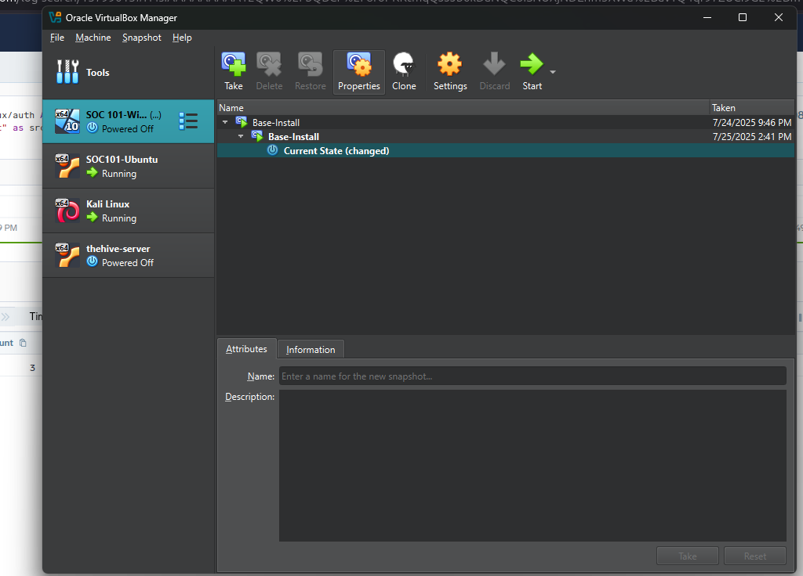
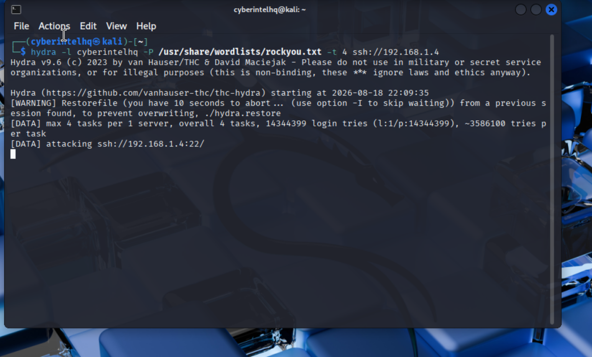
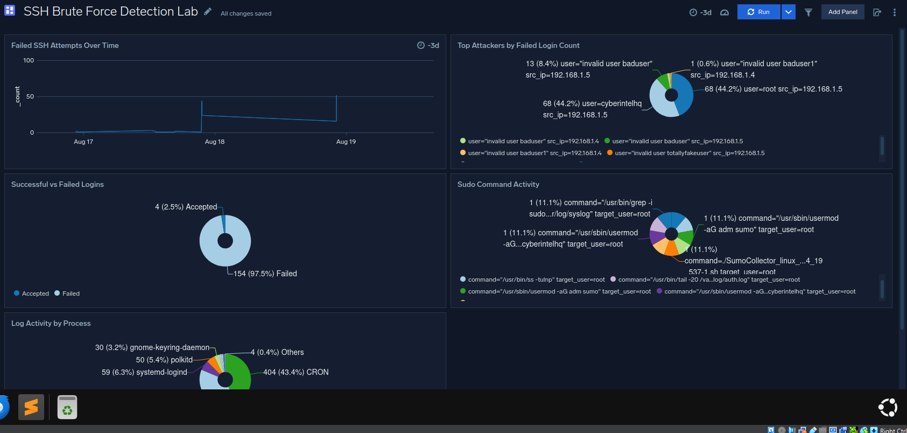
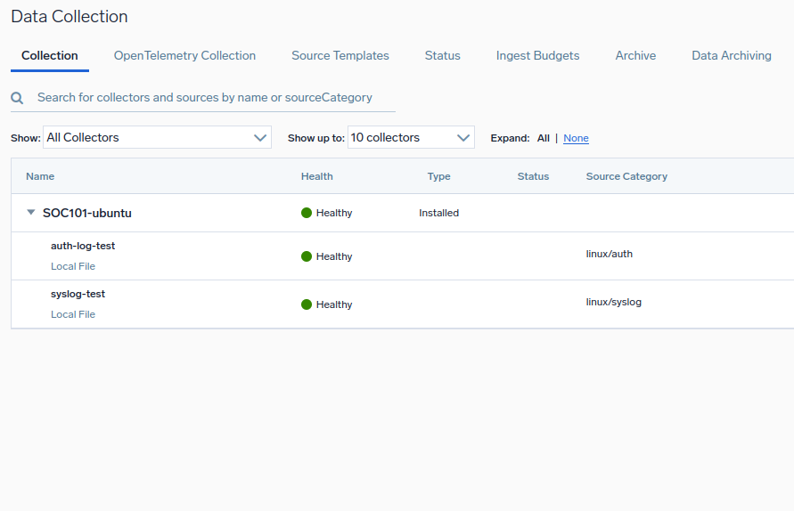
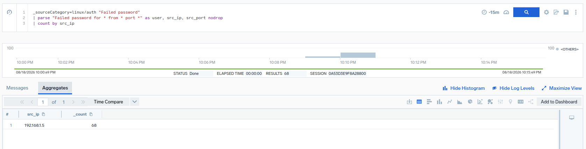
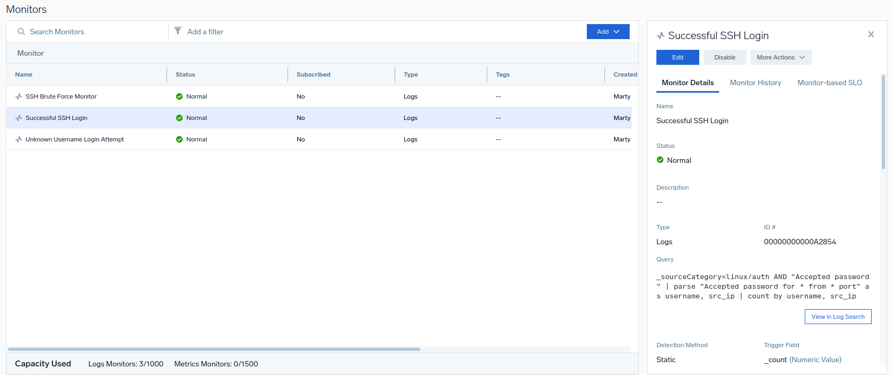
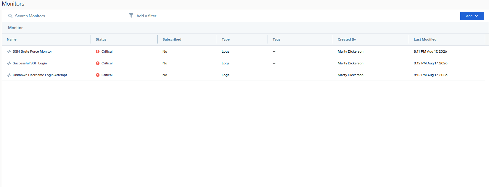
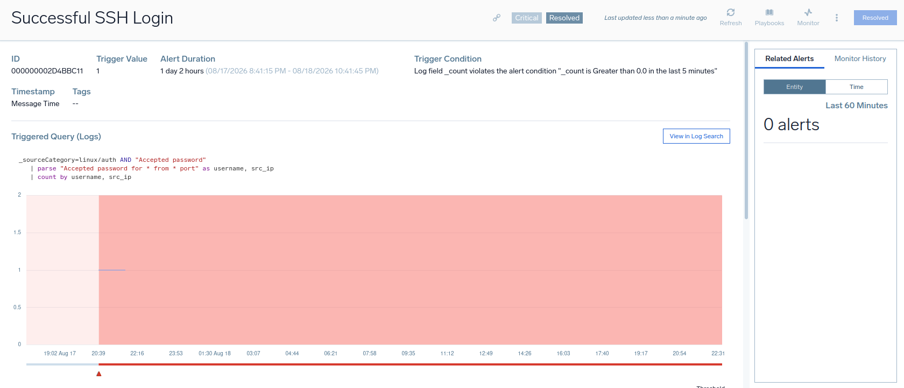

# Linux SOC Detection Suite

This repository documents a home lab for building an end-to-end **SIEM detection pipeline** using:

- **Kali Linux** — attacker/red team VM (Hydra, rockyou.txt)
- **Ubuntu 24.04** — target/blue team VM (Sumo Logic Collector installed)
- **Sumo Logic** — SIEM platform (log ingestion, threshold-based Monitors, alerting)

Logs from `/var/log/auth.log` and `/var/log/syslog` are shipped via the Sumo Logic Collector → ingested as `linux/auth` and `linux/syslog` → detection logic runs as Sumo Logic Monitors → alerts validated by cross-referencing source IPs.

---

## 🚀 Lab Architecture

```
[ Kali Linux VM — 192.168.1.5 ]
 └─ Hydra (SSH brute force) ──────────► attack traffic

[ Ubuntu 24.04 VM — SOC101-ubuntu, 192.168.1.4 ]
 ├─ /var/log/auth.log ──► Sumo Logic Collector ──► linux/auth
 └─ /var/log/syslog   ──► Sumo Logic Collector ──► linux/syslog

[ Sumo Logic (trial, core logging tier) ]
 ├─ Monitors (Logs type, Static threshold)
 │   ├─ SSH Brute Force Monitor
 │   ├─ Unknown Username Login Attempt
 │   ├─ Successful SSH Login
  │ ├─ Sudo / Privilege Escalation Watch
  │ └─ SSH Public Key Authentication Watch
 └─ Alert emails ──► manual correlation by src_ip
```

---

## 📊 Detection Status

| # | Monitor | Trigger | MITRE ATT&CK | Status |
|---|---|---|---|---|
| 1 | SSH Brute Force | Failed password count from same src IP exceeds threshold within 5-min window | T1110 | ✅ Live & validated |
| 2 | Unknown Username Login Attempt | Any `Invalid user` event | T1110.001 | ✅ Live & validated |
| 3 | Successful SSH Login | Any `Accepted password` event | — | ✅ Live & validated |
| 4 | Sudo / Privilege Escalation Watch | Watchlist command (useradd/usermod/passwd/etc.) via `sudo`, count > 0 within 5-min window (Critical) | T1548.003 | ✅ Live & validated |
| 5 | SSH Public Key Authentication Watch | `pubkey_auth_count > 0` within 5-min window (Critical) | T1098.004 | ✅ Live & validated |

---

## 📖 Documentation

👉 Full detection rule write-up (thresholds, MITRE mapping, build gotchas):
[docs/detection-rules.md](docs/detection-rules.md)

👉 Sumo Logic parse query reference:
[queries/sumo-logic-parse-queries.md](queries/sumo-logic-parse-queries.md)

---

## 🖼 Screenshots

**Lab setup — both VMs running in VirtualBox**


**Hydra SSH brute-force attack in progress from Kali**


**Linux SOC Detection Suite — SSH brute-force attack visualized in Sumo Logic**


**Linux SOC Detection Suite dashboard — full attack chain from brute force to persistence**

**Sumo Logic Collector configured to ingest linux/auth and linux/syslog**


**Parsed search results — failed login attempts correctly extracted into `src_ip` and `src_port` fields**


**SSH Brute Force Monitor configuration — threshold, evaluation window, and recovery settings**


**All three monitors in Critical state during the live attack**


**Stale alert investigation — a Successful SSH Login alert stayed open for over a day despite correct recovery settings, and required manual resolution. See [docs/detection-rules.md](docs/detection-rules.md) for the full writeup.**


---

## ⚠️ Known Limitations

- **Low-and-slow attacks:** failed attempts spaced below the 5-minute threshold window evade the brute-force rule (confirmed via testing).
- **Cloud SIEM tier** (Rules, Insights, Signals mapped to MITRE ATT&CK) is not provisioned on the trial account — this lab uses core Monitors instead. See `docs/detection-rules.md` for details.

---

## 🎯 Roadmap

- [ ] Finish Sudo/Privilege Escalation Watch monitor
- [ ] Explore Cloud SIEM tier access
- [ ] Continue toward Sumo Logic certification

---

## ⚠️ Disclaimer

This lab is for **educational and research purposes only**. Not intended for production use.
